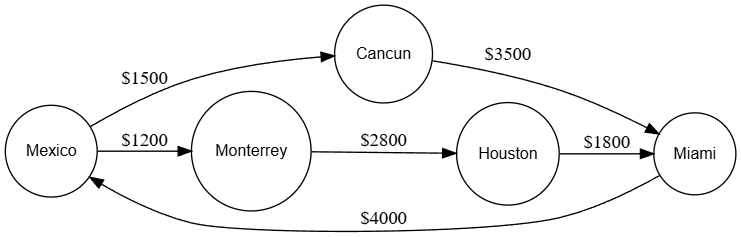
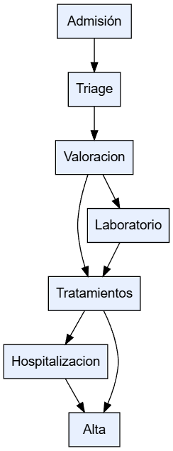

# Tarea 1.2: Modelado de Grafos

## Información
- **Nombre:** Cesar Abraham Ortiz Galvan
- **Fecha:** 04/12/2025

## Ejercicio 1: Sistema de Vuelos
Se modeló una aerolínea como un grafo dirigido y ponderado, donde cada vértice es una ciudad y cada arista representa un vuelo con su precio.
Se calcularon grados de entrada y salida, rutas más económicas y se identificaron ciclos (por ejemplo: México → Cancún → Miami → México).
También se determinó que México es la ciudad con más vuelos salientes y la ruta más barata hacia Miami pasa por Monterrey y Houston.

## Ejercicio 2: Red de Computadoras
Se representó la infraestructura de una oficina como un grafo no dirigido: Router, servidor, switches, PCs e impresoras.
El grafo tiene 10 vértices y 9 aristas, es conexo y forma un árbol (no tiene ciclos).
Se analizó la importancia del Router como nodo crítico: si falla, la red se divide en 3 componentes independientes.
Se identificaron también los grados de cada nodo y la estructura jerárquica de comunicación.

## Ejercicio 3: [Nombre de tu grafo]
El grafo modela el flujo de atención de un paciente en un turno de enfermería: Admisión, Triage, Valoración, Tratamientos, Laboratorio, Hospitalización y Alta.
Es un grafo dirigido que representa el movimiento del paciente entre procesos clínicos.
Se analizaron grados, conexiones, posibles ciclos y se identificó que la Sala de Tratamientos es el nodo más crítico del sistema.
También se planteó una pregunta aplicada: el impacto de la saturación de la Sala de Tratamientos.

